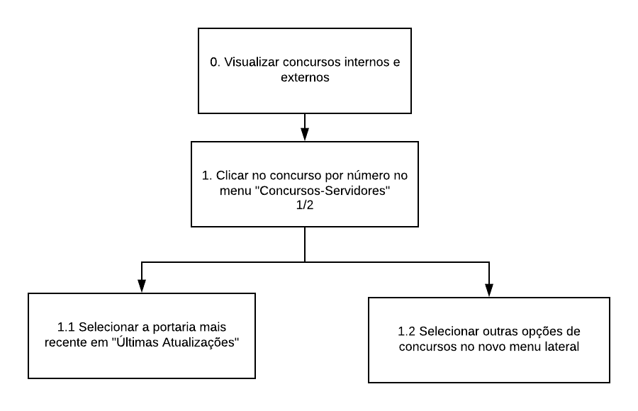
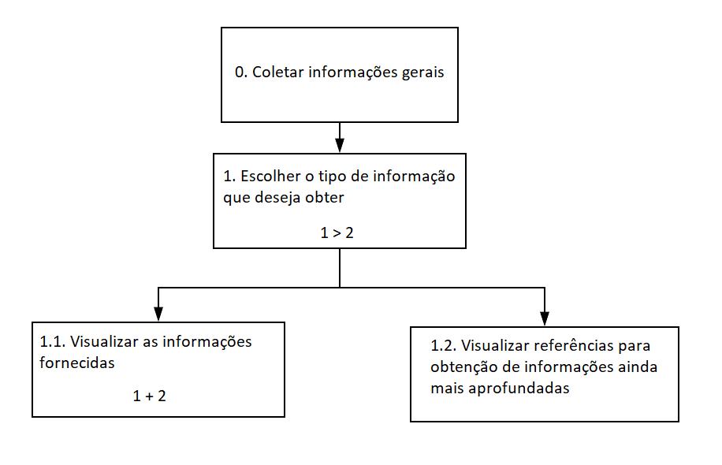

# **Análise de Tarefas**

## **Introdução**

Segundo Barbosa e Silva (2010), uma análise de tarefas é utilizada para se ter um entendimento sobre <mark>qual é o trabalho dos usuários, como eles o realizam e por quê</mark>. Para a elaboração dessa análise, o "trabalho" é definido a partir dos objetivos que os usuários querem ou precisam atingir.

Em IHC, a análise de tarefas pode ser utilizada nas três atividades habituais:

- **Análise de uma situação atual** (apoiada ou não por um sistema computacional)
- **Redesign de um sistema computacional ou para a avaliação do resultado de uma intervenção** que inclua a introdução de um (novo) sistema computacional.
- **Avaliação de um sistema computacional existente**, a análise de tarefas pode ser bem concreta, descrevendo o comportamento de forma detalhada. 

## Análise Hierárquica de Tarefas (HTA – Hierarchical Task Analysis)

<mark>*"Uma tarefa é qualquer parte do trabalho que precisa ser realizada. Toda tarefa pode ser definida em termo de seu(s) objetivo(s)."*</mark> - Barbosa e Silva

A análise hierárquica de tarefas, segundo Barbosa e Silva (2010), examina primeiramente os objetivos de alto nível (por exemplo, marcar uma reunião), decompondo-os em subobjetivos (por exemplo, decidir a data, decidir o  local, convidar  os  participantes  etc.), buscando  identificar quais subobjetivos são  mais difíceis de atingir (ou que geram mais erros) e que, portanto, limitam ou mesmo impedem o atingimento do objetivo maior. No  nível mais baixo da hierarquia de  objetivos, cada subobjetivo é  alcançado por uma operação, que é a unidade fundamental em HTA.

### **Visualização de concursos internos e externos**

<small>*Figura 1: Diagrama HTA, para o objetivo de visualizar concursos internos e externos.*</small>

| Objetivos/Operações | Problemas e Recomendações | 
| :------------------ | :------------------------ | 
| 0. Visualizar concursos internos e externos || 
| 1. Clicar no concurso por número no menu "Concursos-Servidores" | Problema: ao clicar, abre uma nova guia em um novo site (MPF) Recomendação 1: alertar ao usuário sobre o redirecionamento Recomendação 2: agregar as informações desse endereço ao site inicial| 
| 1.1 Selecionar a portaria mais recente em "Últimas Atualizações" || 
| 1.2 Selecionar outras opções de concursos no novo menu lateral | Problema: algumas opções desse menu não aparecem no menu anterior dentro do site do MPU Recomendação: adicionar as opções faltantes ao site inicial |

### **Obtenção de informações gerais**

<small>Figura 2: Diagrama HTA, para o objetivo de coletar informações sobre o MPU</small>

| **Objetivos/Operações** | **Problemas e Recomendações** | 
| :------------------ | :------------------------ | 
| 0. Coletar Informações Gerais || 
| 1. Escolher o tipo de informação que deseja obter 1 > 2 | *Input*: menu dropdown, com variedade de opções *Plano*: visualizar as informações fornecidas **e depois** mais detalhamentos sobre as mesmas|
| 1.1 Visualizar as informações fornecidas 1 + 2 | *Recomendação*: manter a disponibilidade clara de informações úteis e atualizadas   *Plano*: visualizar as informações fornecidas **e** mais detalhamentos sobre as mesmas | 
| 1.2 Visualizar referências para obtenção de informações ainda mais aprofundadas | *Problema*: as informações estão segmentadas em diversas áreas do site  *Recomendação*: popular referências para links, números de telefone ou ainda perguntas mais frequentes, em apenas um local |

## Histórico de Revisões

| Data | Versão | Descrição | Autor(es) |
| :----: | :----: | :----: | :----: |
| 16/03/2021 | 0.0 | Criação do documento | Matheus Clemente|
| 18/03/2021 | 0.1 | Adição do HTA de visualização de concursos | Matheus Clemente |
| 19/03/2021 | 1.0 | Modificações Gerais | José Guilherme |
| 19/03/2021 | 1.1 | Modificações Gerais   +  Adição do HTA de coletar informações gerais | José Guilherme |