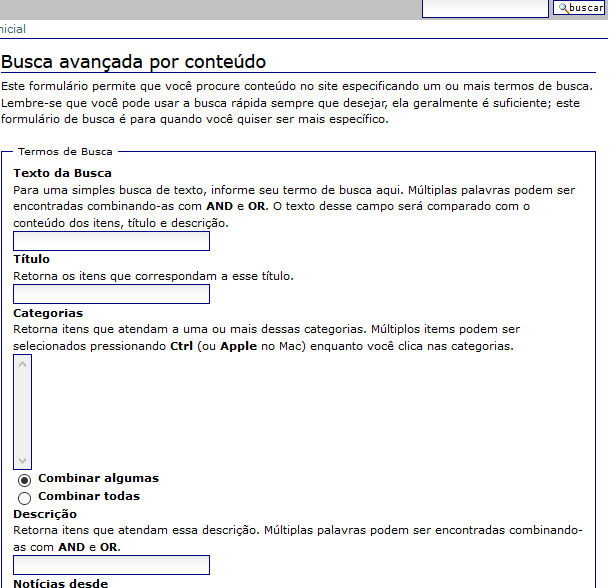

# Guia de Estilo

## Introdução

O objetivo do guia de estilo é fornecer diretrizes sobre as características do site e como elas devem ser apresentadas para garantir coesão com vários desenvolvedores trabalhando no projeto.

## Resultados da Análise

## Elementos

* Informações
  - Histórico
  - Organograma
  - Dúvidas frequentes

* Documentos

* Links úteis
  - Concursos
  - Órgãos
  - Transparência

### Disposição espacial

### Janelas
Percebe-se a falta de padrão ao longo das janelas do site, especificamente entre as janelas inicias e as relacionadas a concursos.

  
*Figura 1 - Tela inicial do site*

  
*Figura 2 - Página do candidato*

  
*Figura 3 - Concurso de remoção*

  
*Figura 4 - Institucional*
### Tipografia
O site faz uso da fonte Verdana, sendo essa a única utilizada ao longo de todo o site.

### Símbolos
Não há uso de símbolos, todo item de menu apresenta escrita por extenso de seu objetivo/funcionalidade.

### Cores

### Animações
O site não faz uso de quaisquer animações

## Elementos de Interação

### Estilos de interação
A interação do usuário se dá primariamente através dos menus ao longo da lateral esquerda do layout do site.

### Seleção de um estilo
Como dito, o estilo de menus predomina ao longo do site.

### Teclas de atalho
Não foram encontrado o uso de teclas de atalho.

## Elementos de Ação

### Campos de preenchimento
O site oferece um recurso de busca, onde o usuário pode preencher um termo-chave a ser procurado. Há ainda uma opção de busca avançada, com filtros específicos a serem preenchidas.
  
*Figura 5 - Busca avançada*

### Seleção
Ainda dentro dos filtros mencionados anteriormente, há uma série de campos que podem ser selecionados para restringir ou ampliar a busca.
  
*Figura 6 - Busca avançada (campos de seleção)*

### Ativação
Após os campos preenchidos e selecionados, o usuário clica no botão "buscar" (figura 6) para efetuar a busca.

## Vocabulário e Padrões

### Terminologia
O site faz uso de diversas siglas referentes a órgãos internos em seus menus, informação tal que não é óbvia ao usuário e pode causar confusão. Muitos dos links denotados por siglas, inclusive, levam a páginas inexistentes.

### Tipos de tela
O padrão de tela da pagína inicial estende-se ao longo do site inteiro, com a excessão das páginas "página do candidato" e "concurso de remoção", como ilustradas anteriormente. A quebra no padrão é tão evidente que facilmente leva o usuário a crer que foi redirecionado para um site totalmente diferente, o que seria longe do incomum em uma navegação usual.

## Histórico de Revisões 

| Data | Versão | Descrição | Autor(es) |
| :----: | :----: | :----: | :----: |
| 26/03/2021 | 0.1 | Estrutura inicial | Irwin Schmitt
| 26/03/2021 | 0.2 | Janelas, elementos e vocabulários e padrões | Matheus Clemente
