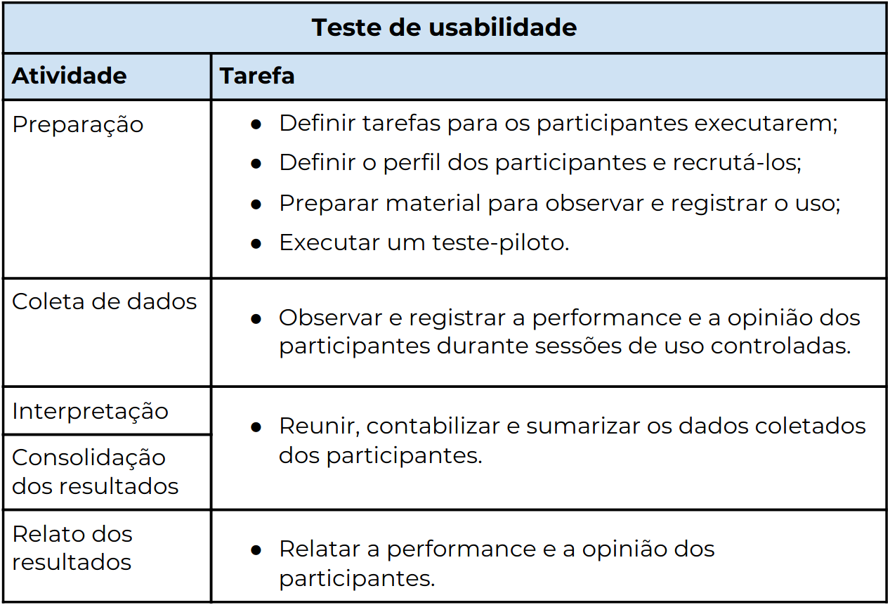

# Planejamento das tarefas

## Objetivo

 
O objetivo de realização de avaliações é validar nossas análises de tarefas com base nos requisitos levantados.

## Metodologia

O Teste de Usabilidade visa a avaliar a usabilidade de um sistema interativo a partir de experiências de uso dos seus usuários-alvo <i>(Rubin, 1994; Rubin e Chisnell, 2008)</i>. 

Para realizar os Teste de Usabilidade,  membros da equipe utilizaram personas como um usuário para realização de uma determinada tarefa seguindo o site do Ministério Público da União , em  ambiente controlado.

Durante as experiências de usabilidade, foram registrados informações sobre o desempenho dos personas na realização de cada tarefa e sua opinião decorrente da experiência de usabilidade.

<figure>

 
<figcaption>Fig. 1 - Tabela de Teste de Usabilidade, livro de Barbosa e Silva: Interação Humano-Computador</a></figcaption>
</figure>

## Resultados 

Durante o processo de avalização dos requisitos para produzir as tarefas, utilizamos os Teste de Usabilidade para validar as análises de tarefas com o auxílio da tabela de Teste de Usabilidade.

Ao final desse processo produzirmos os seguintes referências para os resultados das análises de tarefas:

 
<a href="../resultados/obter-informacoes-gerais">Tarefa: Obtenção de informações gerais
</a>
 
 
<a href="../resultados/visualizar-concursos">Tarefa: Visualização de concursos internos e externos
</a>
 
## Versionamento

| Data | Versão |           Descrição             |    Autor    |
|:----:|:------:|:-------------------------------:|:-----------:|
|06/04 |1     |     Criação do Documento        | Irwin Schmitt |
|07/04 |2     |     Atualização         | Lucas Lopes  |
|21/04 |3     |     Complementação de resultados         | Lucas Lopes  |
|22/04 |4    |     Tabela de Teste de Usabilidade         | Lucas Lopes  |

## Referências
- Livro: BARBOSA, S. D. J.; SILVA, B. S. Interação Humano-Computador. 1ª edição, Rio de Janeiro: Elsevier, 2010.