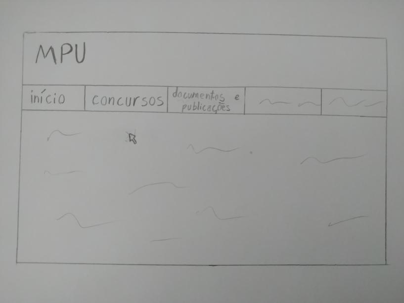
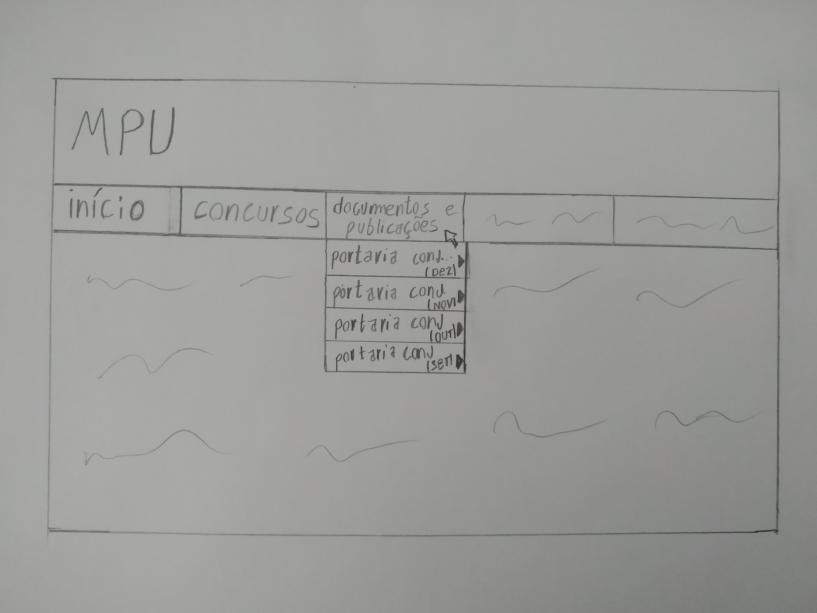
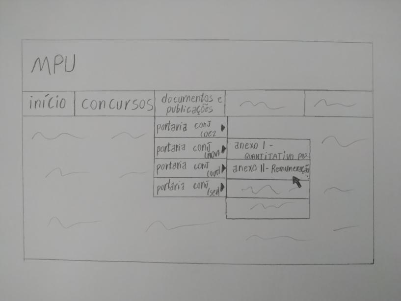

# Protótipo de Papel: Informação sobre Remuneração

*Figura 1: Peças utilizadas na elaboração do protótipo*

*Figura 2: Tela inicial*

*Figura 3: Tela de concursos*

## Histórico de Revisões 

| Data | Versão | Descrição | Autor(es) |
| :----: | :----: | :----: | :----: |
| 21/04/2021 | 0.0 | Criação do documento | Iago Oliveira
| 22/04/2021 | 1.0| Adição de conteúdo | Iago Oliveira

## Referências
##### BARBOSA, S. D. J.; SILVA, B. S. Interação Humano-Computador. 1ª edição, Rio de Janeiro: Elsevier, 2010
