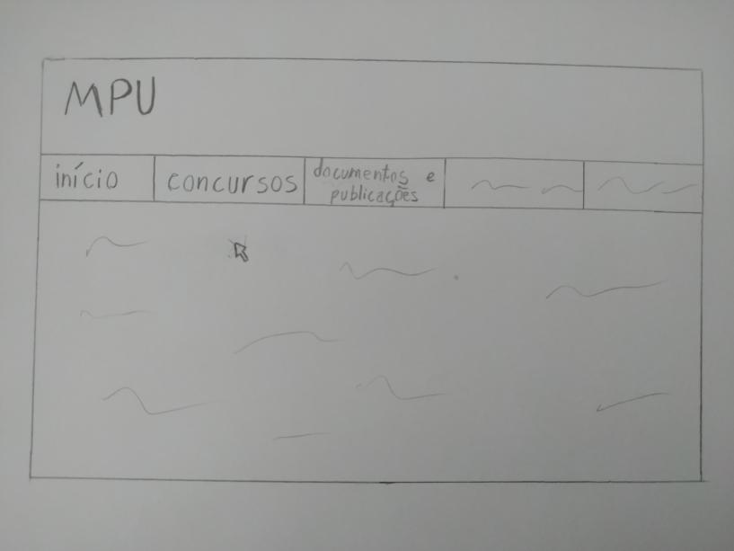
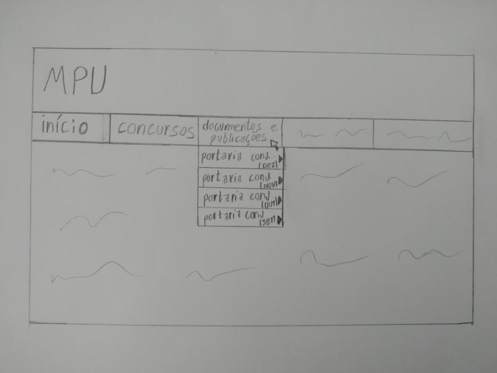
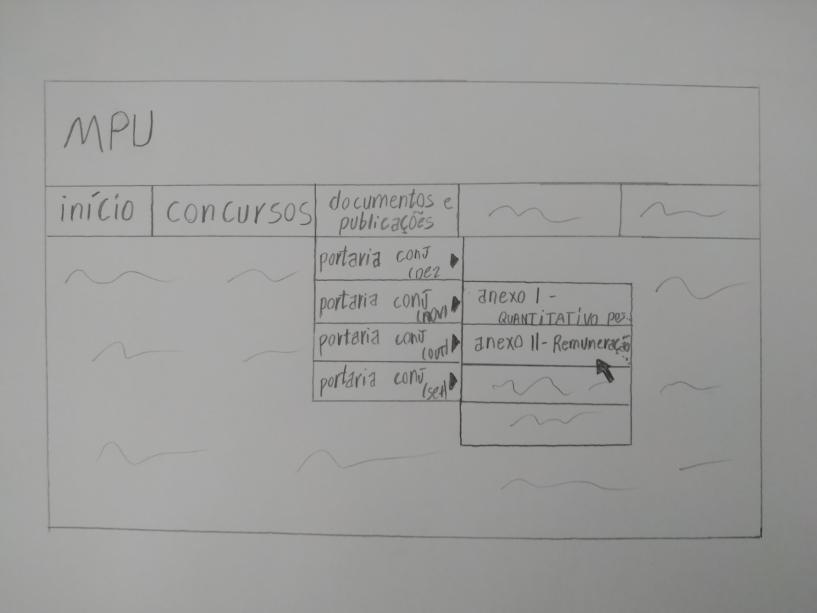

# Protótipo de Baixa Fidelidade: Informação sobre Remuneração

O protótipo definido a seguir busca ilustrar a funcionalidade de "Visualizar Remuneração e Cargos" para o projeto do site do MPU.

*Figura 1: Tela inicial*

*Figura 2: Tela inicial - opções em "documentos e publicações"*

*Figura 3: Tela inicial - opções em "documentos e publicações" - opções da publicação escolhida*

## Histórico de Revisões 

| Data | Versão | Descrição | Autor(es) |
| :----: | :----: | :----: | :----: |
| 21/04/2021 | 0.0 | Criação do documento | Iago Oliveira
| 22/04/2021 | 1.0| Adição de conteúdo | Iago Oliveira
| 22/04/2021 | 1.1| Atualização do documento | Iago Oliveira

## Referências
##### BARBOSA, S. D. J.; SILVA, B. S. Interação Humano-Computador. 1ª edição, Rio de Janeiro: Elsevier, 2010
