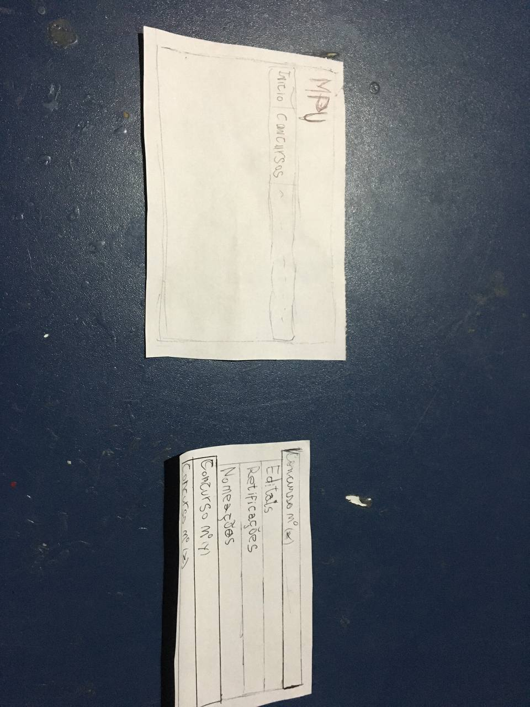
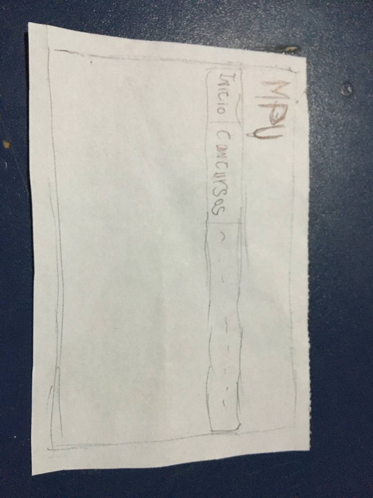
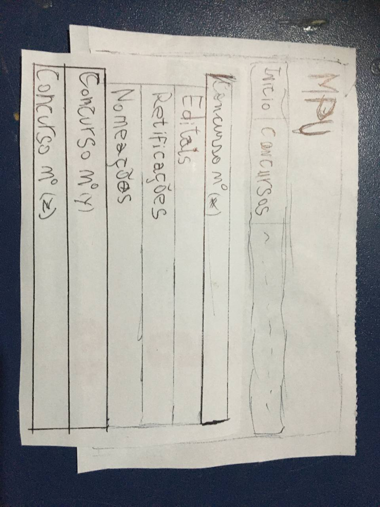

# Protótipo de Papel: Visualizar concursos
O protótipo definido a seguir busca ilustrar a funcionalidade de "Visualizar Concursos" para o projeto do site do MPU.

## Resultado
A seguir são apresentadas as peças e telas criadas para este protótipo.

*Figura 1: Peças utilizadas na elaboração do protótipo*

*Figura 2: Tela inicial*

*Figura 3: Tela de concursos*

## Histórico de Revisões

| Data | Versão | Descrição | Autor(es) |
| --- | --- | --- | --- |
| 22/04/2021 | 1.0 | Criação do documento e protótipo | Matheus Clemente |

## Referências
##### BARBOSA, S. D. J.; SILVA, B. S. Interação Humano-Computador. 1ª edição, Rio de Janeiro: Elsevier, 2010