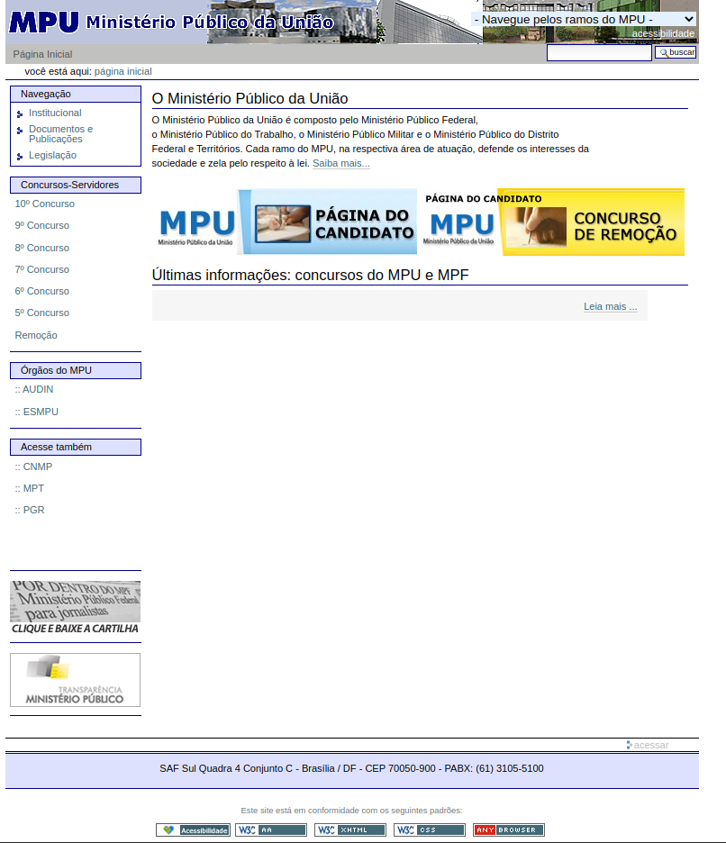
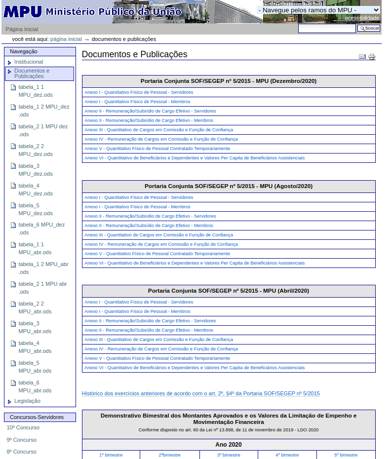
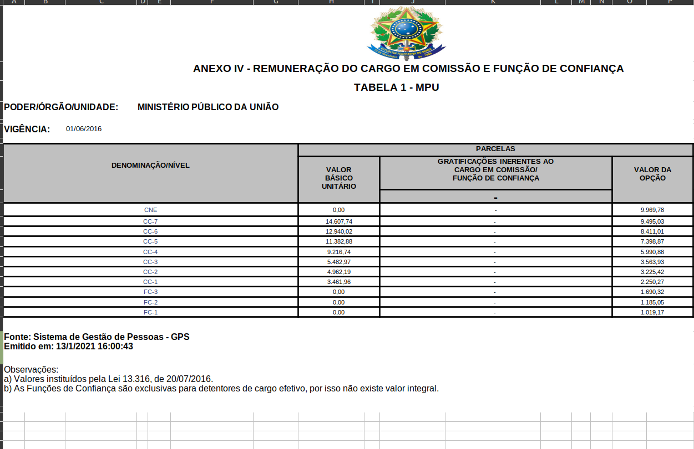

# Teste de usabilidade 
# Obtenção de informações gerais

## Objetivo 

O Teste de Usabilidade tem por objetivo verificar a facilidade que o software ou site possui de ser claramente compreendido e manipulado pelo usuário, através dessa técnica contextualizamos uma situação que uma **Persona** tenta realizar uma tarefa dentro do site do Ministério Público.

## Preparação
A tarefa principal que a **Persona: Júlia Kobayshi** deverá realizar é buscar informações  sobre a remunação de  cargos comissionados dentro do site do MPU:

|Impressões do participante                                       |
|:---------------------------------------------------------------:|
|Como você avalia a facilidade de distinguir os elementos do site?|
|Os ícones do site te auxiliaram na hora de encontrar o que desejava?|
|O design do site te agrada?                                      |
|O que te ajudou/atrapalhou mais na realização da tarefa?         |

#### Participante
A participante tem 27 anos, é formada em administração e é funcionária pública concursada que trabalhando no Ministério Público da União, ela assumiu recentemente o cargo a um ano e aspira um cargo mais alto dentro do própio órgão.

Possui um conhecimento mais prático no acesso a sites de  órgãos públicos.

#### Materiais
Os materiais utilizados na avaliação foram:

* Computador com acesso à internet
* Teclado/Mouse no padrão brasileiro
* Monitor de computador
* O site do Ministério Público da União aberto em tela cheia
* Cadeira que permite ajuste para uma boa vizualização da tela
* Cronômetro para calcular o tempo de cada ação

#### Teste piloto

O teste piloto é realizado de forma que os materiais e o 
site fossem disponibilizados e permitissem avançar a avaliação com a participante.

O resultado foi satisfatório, a ação pode ser realizada sem interrupções
por parte dos equipamentos e do software.

## Coleta de dados
A participante foi orientada a sentar-se e foi informada da tarefa
a ser realizada, dado um momento de início e  iniciado o cronômetro de modo
que a participante fosse autorizada a iniciar sua ação.

O quadro abaixo dispõe os pontos principais da execução da tarefa:

|Descrição da ação| Tempo em segundos               |
|:---------------:|:-------------------------------:|
|Acessar o mouse com a mão               |1.5       |
|Observar a página                       |4.5       |
|Posicionar o cursor ao menu lateral                   |2.7       |
|Posicionar o curso até imagem(1)              |4.1       |
|Navegar até  Documentos e Publicações |2.1       |
|Reconhecer os itens                     |9.3       |
|Ler as tabelas de Portaria conjunta             |8.6       |
|Posicionar o cursor à imagem(2)              |9.0       |
|Posicionar o curso à imagem(3)              |3.0       |
|Navegar até Anexo IV - Remuneração de Cargos em Comissão e Função de Confiança              |1.8       |
|Clicar em Anexo IV - Remuneração de Cargos em Comissão e Função de Confiança                      |2.5       |
|Total                                   |**49.1**  |

Imagem 1 - Home do site

 

Imagem 2 - Página de Documentos e Públicações

 

Imagem 3 - Arquivo de Remuneração e Cargos

 

## Interpretação e consolidação dos resultados

#### Perspectiva de participante
A participante se queixou de dificuldade de ler claramente os textos presente em decorrência do tamanho de fonte a utilizada no site, que é de tamanho pequeno e a altura entre as linhas é bem próxima, o que a fez demorar mais que o normal para ler cada.

A respeito do Design, o site para a usuária do site,  não trouxe um direcionamento de visão e parte chamativas que indicassem  áreas de realce.

Em relação a palheta de cores, a usuária do site relatou um distinção clara da fonte, por exemplo, " cor azul da fonte com o fundo branco torna mais difícil ler os textos sem se distrair".

#### Observações técnicas
* O site apresenta falhas graves de usabilidade quando se observa o uso
  por usuários com familiaridade com sites de função semelhante . 
* Os elementos elementos do menu lateral possuem pouco destaque e distinção de um texto comum em relação ao  nome/objetivo que se destina.
* O design do site  e a palheta de cores do site provocam dificuldade dos usuários ao identificarem e distinguirem textos.
* A disposição dos elementos do site provocam distração e perca de foco do  usuário, em partes que 
  demora mais  para ler e compreender o que representa aquela parte do site.

## Resultados
#### Sujestões de melhoria
* Reformulação  e adoção de uma palheta de cores mais destacas para o site de forma que o usuário se 
  sinta mais familiarizado com o modo com que o site funciona, reduzindo o tempo
  de busca pela ferramenta desejada.
* Re-escrita e aumento de fonte em textos para maior clareza.
* Implementação de responsividade ao site

### Referências

* Livro: BARBOSA, S. D. J.; SILVA, B. S. Interação Humano-Computador. 1ª edição, Rio de Janeiro: Elsevier, 2010.

### Versionamento

| Data | Versão |           Descrição             |    Autor       |
|:----:|:------:|:-------------------------------:|:--------------:|
|21/04 | 0      |     Criação do documento        | Lucas Lopes   |
|22/04 |1      |     Criação do Teste            |Lucas Lopes     |
