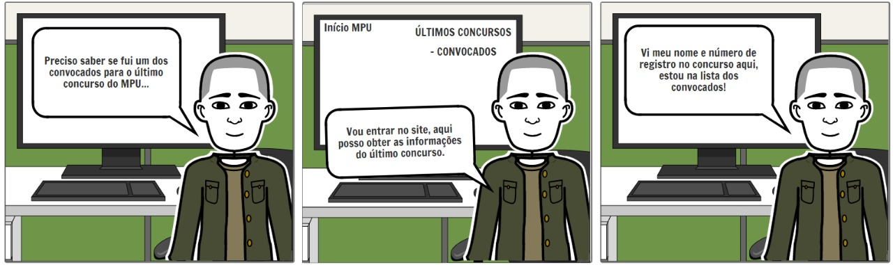

# StoryBoard: Acessar Últimos Convocados

## Preparo:

### Informações gerais:

A **persona relacionada** é Júlia Kobayshi e se passa em seu ambiente de trabalho, a tarefa que deseja completar é buscar informações no site do MPU a respeito dos últimos convocados para o concurso que ele prestou, pois ele deseja saber se é um dos convocados.

### Passos que a tarefa envolve:

1. Acessar o site do MPU, portanto estará no Início;
2. No menu lateral, acessar os últimos concursos;
3. Clicar na opção de últimos convocados e pesquisar pelo seu nome.

#### Motivação:

Verificar se é um dos convocados.

#### Definição do StoryBoard:

A busca da persona pelos últimos convocados.

## Satisfação:

#### Tarefas que a aplicação permite:

Confiabilidade de oficiais sobre os dados oferecidos.

#### Tarefas que precisam ser implementadas:

As informações devem ser parseadas e melhor disponibilizadas para o usuário, de forma objetiva e oficial. Por exemplo, podendo buscar pelo seu nome ao invés de ler o edital inteiro.

##### autor: José Guilherme

## Referências

##### Livro: BARBOSA, S. D. J.; SILVA, B. S. Interação Humano-Computador. 1ª edição, Rio de Janeiro: Elsevier, 2010.

## Versionamento

| Data | Versão |           Descrição             |    Autor    |
|:----:|:------:|:-------------------------------:|:-----------:|
|06/04 |v0.1      |     Criação do Documento        | José Guilherme |
|04/04 |v1.0      |     Criação do Storyboard       | José Guilherme  |