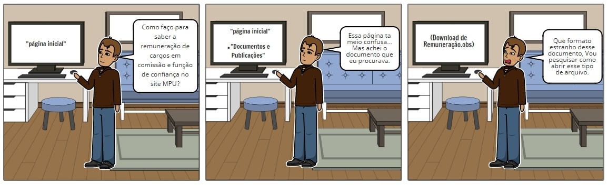

# StoryBoard: Informação sobre Remuneração

## Preparo:

### Informações gerais:

A **persona relacionada** é Alexandre Gomez e se passa em sua própria casa, o objetivo dele em sua tarefa é se informar sobre a remuneração de cargos em comissão e função de confiança no site do MPU.

### Passos que a tarefa envolve:

1. Acessar o site do MPU;
2. No menu lateral da página inicial, acessar Documentos e Publicações;
3. Clicar na opção referente a remuneração do tipo de cargo que ele deseja saber.

#### Motivação:

Ter conhecimento sobre a remuneração de tais cargos, almejando o que for lhe for interessante futuramente.

#### Definição do StoryBoard:

A busca da persona sobre a remuneração de cargos.

## Satisfação:

#### Tarefas que a aplicação permite:

Acesso do usuário a documentos que trazem muitas informações.

#### Tarefas que precisam ser implementadas:

As informações nessa página devem ser organizadas de uma maneira mais clara e disponibilizadas para o usuário em um formato de texto mais acessível. É necessário também consertar links que apresentam algum tipo de erro ou não levam a lugar algum.

##### autor: Iago Oliveira

## Versionamento

| Data | Versão |           Descrição             |    Autor    |
|:----:|:------:|:-------------------------------:|:-----------:|
|05/04 |1      |     Criação do Documento        | Iago Oliveira |
|08/04 |2      |     Criação do Storyboard       | Iago Oliveira  |
|15/04 |3     |     Remoção de trecho        | Lucas Lopes  |

## Referências

##### Livro: BARBOSA, S. D. J.; SILVA, B. S. Interação Humano-Computador. 1ª edição, Rio de Janeiro: Elsevier, 2010.