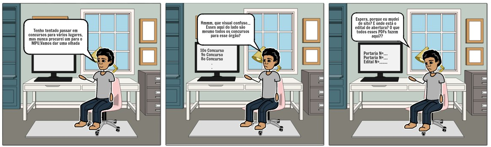

# StoryBoard: Visualizar concursos
## Preparo
### Definição das pessoas envolvidas

- Persona: Alexandre Gomes, 20 anos, estudante de fisioterapia.
### Definição do ambiente da história

- Quarto de Alexandre, em seu computador pessoal.
### Definição da tarefa que será abordada

- Acessar a página de concursos do MPU para conferir se há algum com inscrições abertas para  que Alexandre participe.
## Sequência
### Definição de quais passos estão envolvidos para realização da tarefa

1. Acessar o site do MPU.
2. Clicar em um concurso na aba lateral "Concursos-Servidores".
3. Acessar o edital referente ao concurso selecionado.
### Definição do que leva a pessoa a usar a aplicação

- Interesse em buscar informações sobre concursos referentes ao MPU.
### Definição de qual tarefa será ilustrada

-  Na tarefa lustrada, Alexandre busca conseguir informações sobre os últimos concursos abertos para o MPU, afim de que possa participar do processo seletivo.
## Satisfação
### Definição da motivação principal da pessoa que usa a aplicação

- Acesso a informação sobre concursos do MPU.
### Definição das realizações que a aplicação permite

- Acessar editais de concursos referentes ao MPU.
### Definição das necessidades que a aplicação se propõe a sanar

- Acesso rápido e eficaz a informações confiáveis sobre concursos para entrada no Ministério Público da União.
## Storyboard:
 *FIgura 1: Storyboard feito com a ferramenta online StoryboardThat*

##### autor: Matheus

## Histório de Revisões

| Data | Versão | Descrição | Autor(es) |
| --- | --- | --- | --- |
| 08/04/2021 | 1.0 | Criação do documento e storyboard | Matheus Clemente |

## Referências

##### Livro: BARBOSA, S. D. J.; SILVA, B. S. Interação Humano-Computador. 1ª edição, Rio de Janeiro: Elsevier, 2010.