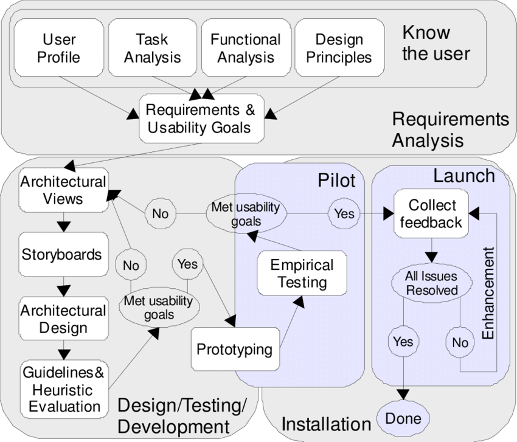

O processo de design detalha as atividades básicas do design - a análise da situação atual, a síntese de uma intervenção e a avaliação dessa intervenção projetada ou já aplicada à situação atual - de uma forma particular, definindo: como executar cada atividade; a sequência em que elas devem ser executadas; quais atividades podem se repetir, e por quais motivos; e os artefatos consumidos e produzidos em cada uma delas <i>(Barbosa e Silva, 2010). </i>

O processo de design escolhido pelo time foi a Engenharia de usabilidade de Mayhew.

## Engenharia de usabilidade de Mayhew

 Deborah Mayhew (1999) propôs um ciclo de vida para a engenharia de usabilidade, através de um processo de design que reúne e organiza diferentes atividades propostas na área de IHC para orientar o trabalho do designer em direção a uma boa solução interativa. Esse processo iterativo divide-se em três fases: análise de requisitos, design/avaliação/desenvolvimento e instalação.

<figure>

 
<figcaption>Fig. 1 - Diagrama da Engenharia de usabilidade de Mayhew, desenvolvido com base no diagrama apresentado por Barbosa e Silva (2010).</a></figcaption>
</figure>

## Referências
- Livro: BARBOSA, S. D. J.; SILVA, B. S. Interação Humano-Computador. 1ª edição, Rio de Janeiro: Elsevier, 2010.